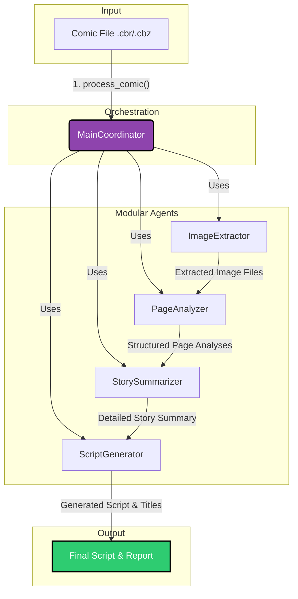

# Comic Script Generator: Modular Agents Architecture

This document provides an overview of the software architecture for the Comic Script Generator, a pipeline built with a set of modular, specialized agents.

## Core Components

The system is composed of several Python modules, each responsible for a specific task in the pipeline. The `MainCoordinator` acts as the central orchestrator, managing the flow of data between the other agents.

**`main_coordinator.py`**: The heart of the application. The `MainCoordinator` class initializes all other agents and manages the end-to-end workflow, from image extraction to final script generation. It defines the sequence of operations and handles the data as it's processed by each agent.

 **`image_extractor.py`**: This module's `ImageExtractor` class is responsible for extracting image files from comic book archives (`.cbr`, `.cbz`). It supports standard ZIP-based archives and can also use the `unar` command-line tool as a fallback for other formats.

**`page_analyzer.py`**: The `PageAnalyzer` class uses the Google Gemini multimodal AI to analyze each extracted image. It identifies whether a page is part of the story, extracts key information (characters, setting, actions), and can run these analyses in parallel to speed up processing.

**`story_summarizer.py`**: The `StorySummarizer` agent takes the structured data from the `PageAnalyzer` (specifically, the pages identified as story content) and uses an AI model to generate a detailed, narrative summary of the entire comic book plot.

**`script_generator.py`**: The final agent in the pipeline. The `ScriptGenerator` class takes the story summary and transforms it into an engaging YouTube script. It uses a highly detailed prompt with multiple examples to ensure the output matches a specific conversational style, tone, and structure.

**`config.py`**: A configuration module that loads settings from a `.env` file, such as the `GEMINI_API_KEY` and the name of the generative model to be used by the agents.

**`word_utils.py`**: A small utility module that provides helper functions, such as `count_words`, which is not currently used by the main pipeline but is available for utility purposes.

## Architecture and Workflow

The architecture is designed as a sequential pipeline orchestrated by the `MainCoordinator`. Each agent performs a distinct transformation on the data, and the output of one agent becomes the input for the next. This modular design makes the system easy to maintain, test, and extend.

The diagram below illustrates the flow of data and the interaction between the components.

### Step-by-Step Workflow

1. **Initiation**: The process begins when the `MainCoordinator.process_comic()` method is called with the path to a comic file.

2. **Image Extraction**: The `MainCoordinator` uses the `ImageExtractor` to extract all image files from the comic archive into a temporary directory.

3. **Page Analysis**: The list of extracted image paths is passed to the `PageAnalyzer`. It processes each image in parallel, sending them to the Gemini API to get a structured JSON analysis for each page.

4. **Content Filtering**: The `PageAnalyzer` then filters these results, separating core story pages from non-story content like ads, credits, or cover pages.

5. **Story Summarization**: The filtered list of story-only analyses is given to the `StorySummarizer`. This agent synthesizes the information into a single, coherent, and detailed narrative summary of the plot.

6. **Script Generation**: Finally, the `ScriptGenerator` takes this summary and produces the final YouTube script, along with title suggestions, adhering to a specific stylistic format.

7. **Reporting**: Throughout this process, the `MainCoordinator` saves intermediate artifacts (page analyses, summary) and generates a final comprehensive markdown report that includes the script, word counts, and other metadata about the run.
